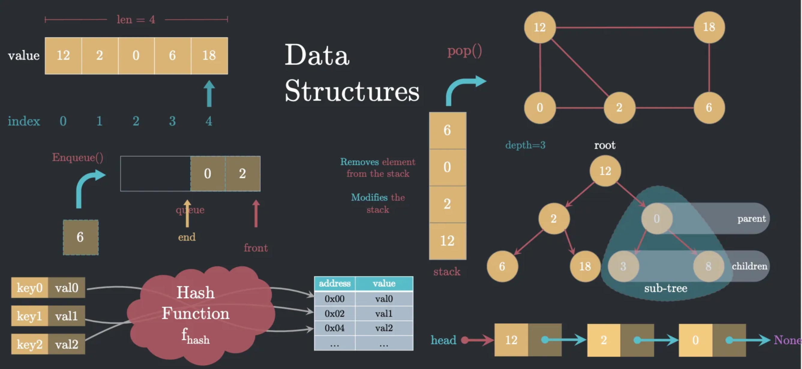

Data Structure
==================

Abstract Data Type（抽象数据类型）
-----------------------------------

抽象数据类型 = 数据类型 + 操作， 是抽象的，是一种逻辑上的概念，不是具体的实现。

https://en.wikipedia.org/wiki/Abstract_data_type

Data Structure （数据结构）
-----------------------------

数据结构 = 数据类型 + 数据类型的存储方式， 是具体的，可以被计算机实现的和使用的。

https://en.wikipedia.org/wiki/Data_structure

常用的数据结构
----------------------

- Array/List
- Linked List
- Hash Table
- Queue
- Stack
- Tree
- Graph
