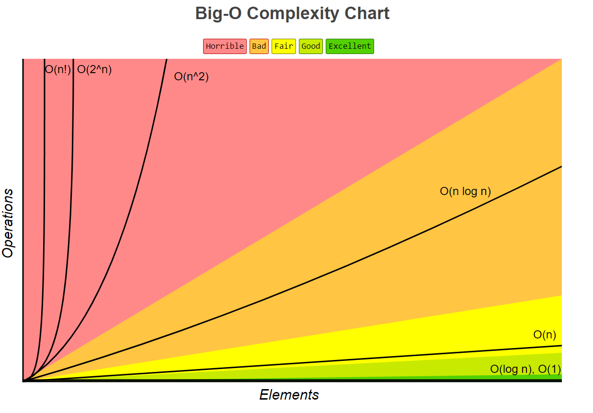

Big O notation
=================

BIG O表示算法的时间复杂度，用来描述算法在 ``最坏情况下`` 的运行时间的增长率。简单来说，它是一种度量算法效率的方式，表示算法的运行时间与输入规模的增长率之间的关系。

Types of Big O Notations
----------------------------

There are seven common types of big O notations. These include: (orderd from best to worst)

- O(1): Constant complexity.
- O(logn): Logarithmic complexity.
- O(n): Linear complexity.
- O(nlogn): Loglinear complexity.
- O(n^x): Polynomial complexity.
- O(X^n): Exponential time.
- O(n!): Factorial complexity.

参考 https://www.bigocheatsheet.com/

常用算法的Big O
-------------------

请参考 https://www.bigocheatsheet.com/

.. literalinclude:: ../_code/1-introduction/bigo.py
   :language: python
   :linenos: