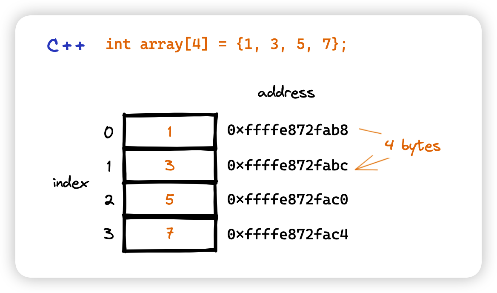
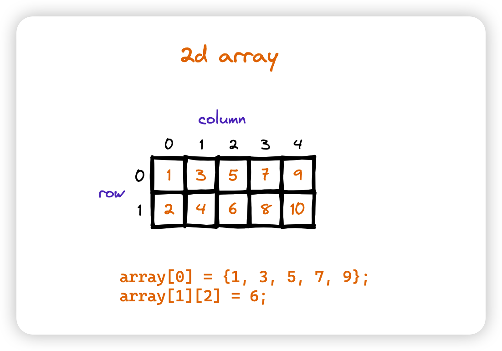

What is Array
===============

Array(数组)
--------------

https://en.wikipedia.org/wiki/Array_(data_structure)

An array is a collection of items of same data type stored at contiguous memory locations.
数组就是把一组相同类型的数据存储在连续的内存空间中。

The idea is to store multiple items of the same type together.
This makes it easier to calculate the position of each element by simply adding an offset to a base value,
i.e., the memory location of the first element of the array (generally denoted by the name of the array).

在C语言中，数组的大小是固定的。一旦声明了数组的大小，就不能再改变了。原因很简单，假如要扩展数组的大小，就需要在当前数组所在内存后面的连续内存空间增加一块内存，
然而很难保证当前数组所在内存后面的内存空间是空闲的。

一维和多维数组
---------------

一维数组就是数组中的每个元素都是一个单独的变量，多维数组就是数组中的每个元素还是一个数组。

数组优势
---------

- 基于index的快速访问(地址连续，偏移量相同)
- 易实现

数组的缺点
-----------

- 无法动态扩展
- resize的代价高 O(n)
- 通常只能存储同一类型的数据 （Python是例外之一）