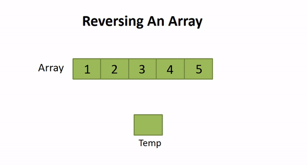
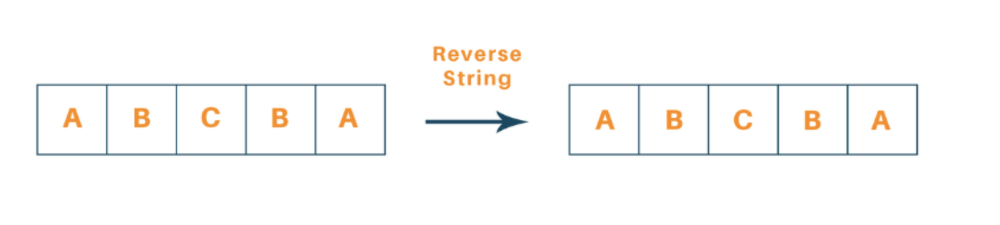
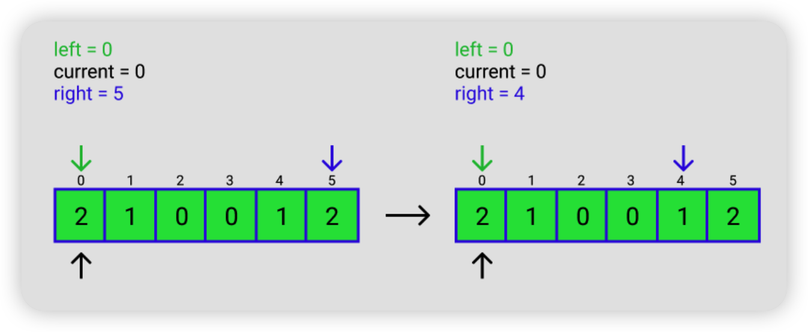
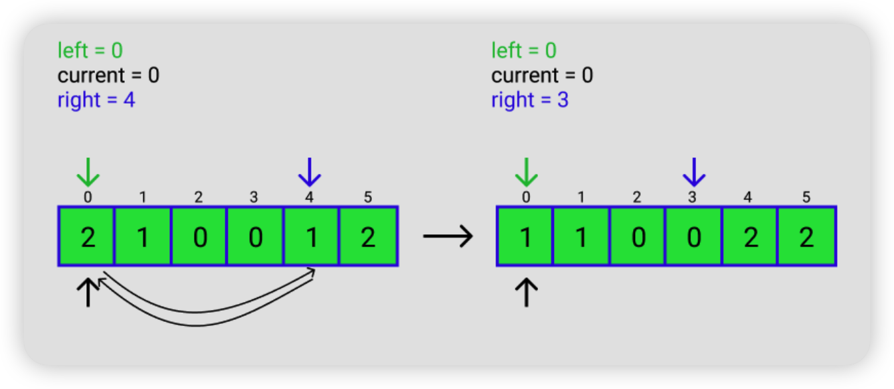
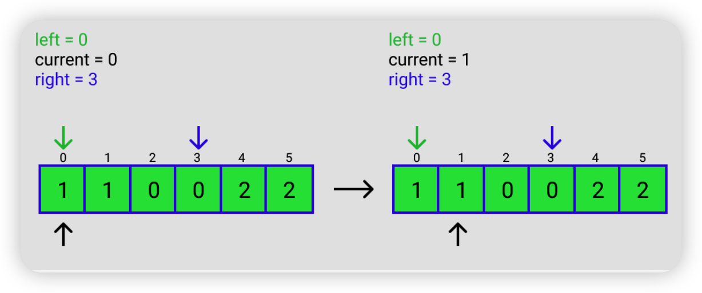
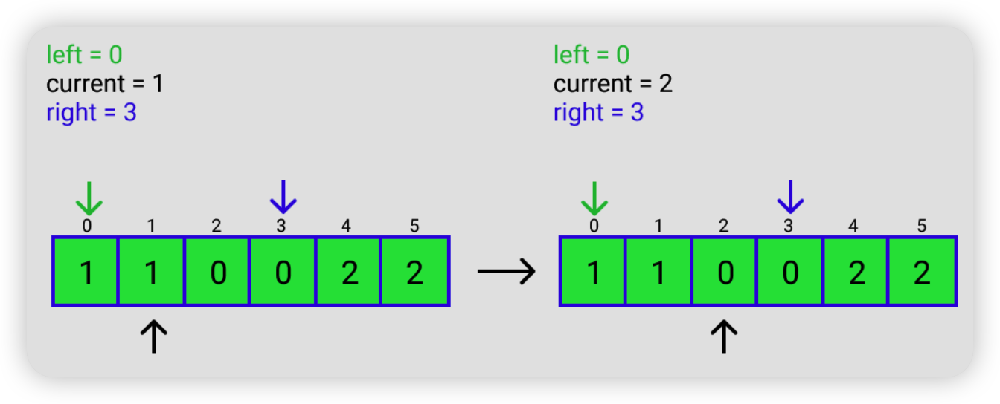
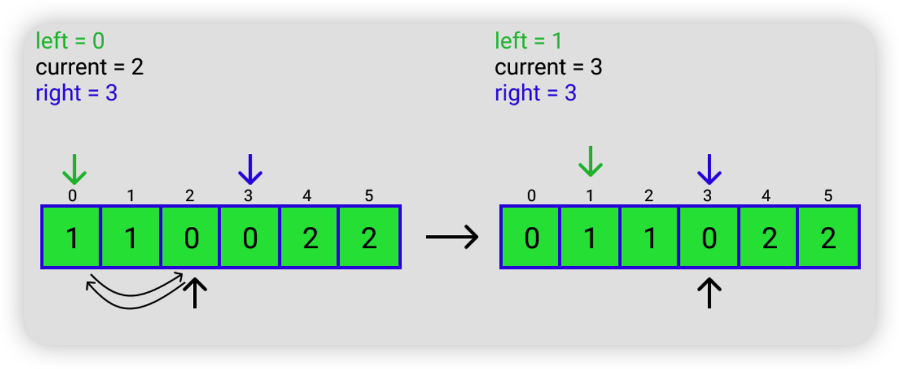
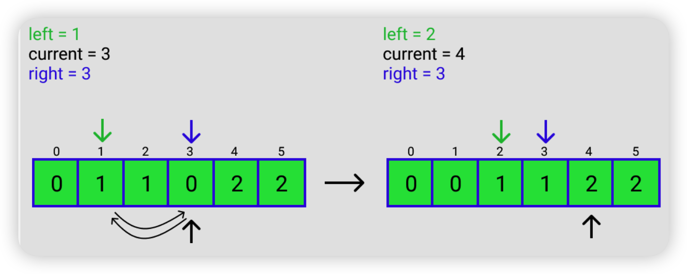

Reversing an Array
====================

Solution Steps

- Place the two pointers (let start and end) at the start and end of the array.
- Swap arr[start] and arr[end]
- Increment start and decrement end with 1
- If start reached to the value length/2 or start ≥ end, then terminate otherwise repeat from step 2.

.. literalinclude:: ../_code/2-array/reverse_array.py
   :language: python
   :linenos:

相关练习
------------

Integer reversion
~~~~~~~~~~~~~~~~~~~~~~~~~~~~

https://leetcode.com/problems/reverse-integer/

.. literalinclude:: ../_code/2-array/reverse_integer.py
   :language: python
   :linenos:

Palindrome Problem
~~~~~~~~~~~~~~~~~~~~~~~~~~~~

https://en.wikipedia.org/wiki/Palindrome

.. literalinclude:: ../_code/2-array/palindrome.py
   :language: python
   :linenos:

LeetCode

https://leetcode.com/problems/valid-palindrome/

https://leetcode.com/problems/valid-palindrome-ii/

https://leetcode.com/problems/longest-palindromic-substring/

https://leetcode.com/problems/longest-palindromic-subsequence/

https://leetcode.com/problems/palindromic-substrings/

Dutch National Flag Problem
----------------------------------------

一个只有0，1，2三种元素的数组，要求把0放在前面，1放在中间，2放在后面。

解题思路总结成一句话就是，把2往后放，把0往前放。

具体思路如下，假如输入的是  ``[2, 1, 0, 0, 1, 2]``

LeetCode

https://leetcode.com/problems/sort-colors/

.. literalinclude:: ../_code/2-array/dutch_flag.py
   :language: python
   :linenos:

Trapping Rain Water Problem
------------------------------------

https://algodaily.com/challenges/trapping-rain-water

LeetCode

https://leetcode.com/problems/trapping-rain-water/

.. literalinclude:: ../_code/2-array/trapping_water.py
   :language: python
   :linenos:

Anagram Problem
-----------------------

Anagram问题指的是判断两个字符串中的字符是否完全相同，只是顺序不同。例如，“listen”和“silent”就是一对anagram

https://leetcode.com/problems/valid-anagram/

https://leetcode.com/problems/find-all-anagrams-in-a-string/

https://leetcode.com/problems/group-anagrams/

.. literalinclude:: ../_code/2-array/anagram.py
   :language: python
   :linenos:
