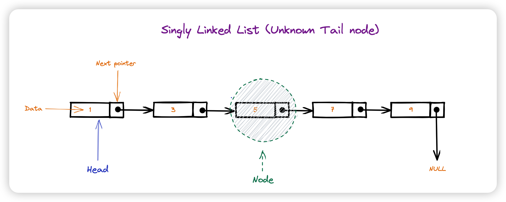
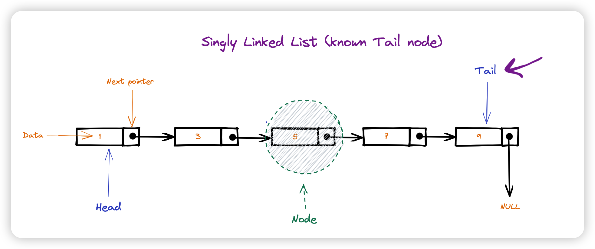
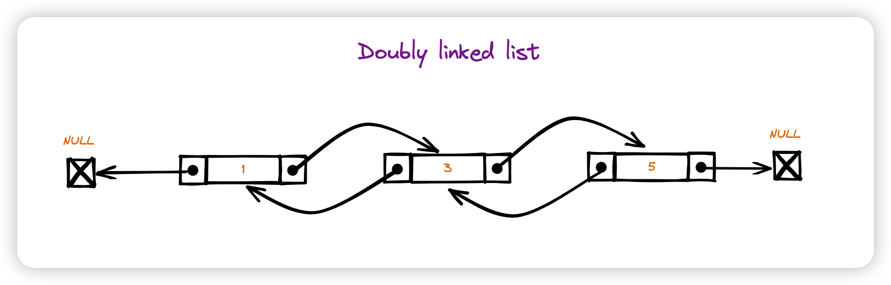

Linked Lists
==============

链表（Linked List）是一种常见的数据结构，用于存储一系列元素，每个元素由一个值和一个指向下一个元素的指针组成。

https://en.wikipedia.org/wiki/Linked_list

链表可以分为单向链表和双向链表。

单向链表
--------------

在单向链表中，每个节点都只有一个指针，指向下一个节点。

https://en.wikipedia.org/wiki/Linked_list

双向链表
------------

在双向链表中，每个节点都有两个指针，一个指向前一个节点，一个指向后一个节点。

