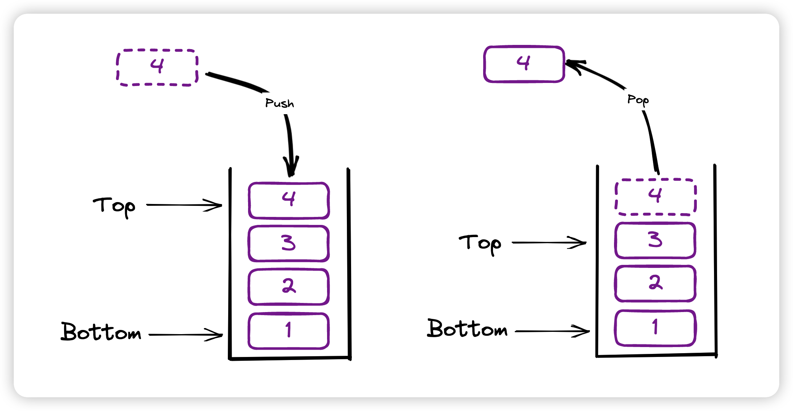

Stacks
===========

Stack（堆栈）是一种线性数据结构，其操作遵循先进后出（LIFO），后进先出（FILO）的原则。

Stack is a linear data structure that follows a particular order in which the operations are performed.
The order may be ``LIFO`` (Last In First Out) or ``FILO`` (First In Last Out).
LIFO implies that the element that is inserted last, comes out first and FILO implies that the element that is inserted first, comes out last.

