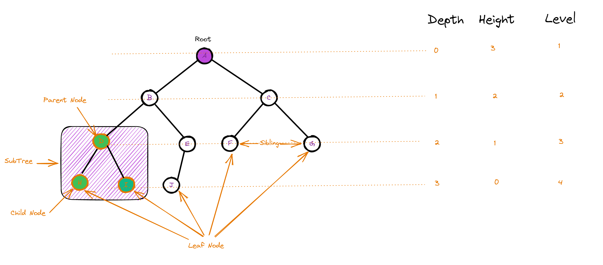

Introduction
================

树形数据结构是一种用于表示和组织数据的层次结构，以便于导航和搜索。
它是由节点和边连接而成的集合，并且节点之间具有层次关系。树的顶层节点称为根节点，其下方的节点称为子节点。每个节点可以有多个子节点，而这些子节点也可以有它们自己的子节点，形成一个递归结构。

高度深度和层
-------------------

树的高度（Height）指的是从根节点到最远叶子节点的边数，也可以理解为树的深度（Depth）。

树的深度（Depth）指的是从根节点到当前节点的边数，也可以理解为节点的层数（Level）。

节点的层数（Level）是指从根节点开始，到该节点所经过的边数（不包括该节点所在的边），根节点的层数为1

Binary Tree (二叉树)
---------------------------

二叉树是一种特殊的树形结构，它的每个节点最多只能有两个子节点。二叉树的子节点分为左子节点和右子节点.

Binary Search Tree (二叉搜索树)
-----------------------------------

二叉搜索树是一种特殊的二叉树，它的每个节点都满足以下条件：

* 左子节点的值小于父节点的值
* 右子节点的值大于父节点的值

满二叉树（Full Binary Tree），也称为真二叉树或者严格二叉树，是一种特殊的二叉树，其中每个非叶子节点都恰好有两个子节点，并且所有叶子节点都在相同的深度上。

.. image:: ../_static/6-tree/full-binary-tree.PNG
   :width: 400px

.. image:: ../_static/6-tree/full-perfect.PNG
   :width: 400px
