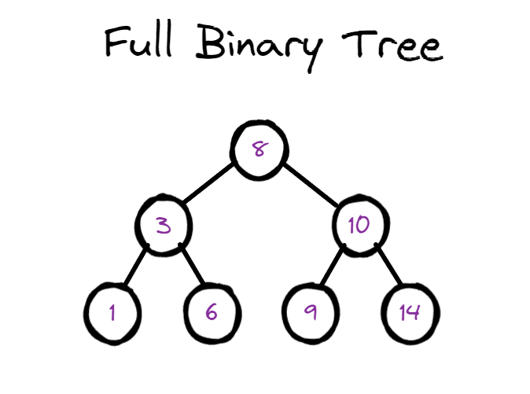

Binary Search Tree
======================

Binary Tree (二叉树)
---------------------------

二叉树是一种特殊的树形结构，它的每个节点最多只能有两个子节点。二叉树的子节点分为左子节点和右子节点.

Binary Search Tree (二叉搜索树)
-----------------------------------

二叉搜索树是一种特殊的二叉树，它的每个节点都满足以下条件：

* 左子节点的值小于父节点的值
* 右子节点的值大于父节点的值

满二叉树（Full Binary Tree），也称为真二叉树或者严格二叉树，是一种特殊的二叉树，其中每个非叶子节点都恰好有两个子节点，并且所有叶子节点都在相同的深度上。

.. image:: ../_static/6-tree/full-perfect.PNG
   :width: 400px
   
https://en.wikipedia.org/wiki/Binary_search_tree

二叉搜索树（Binary Search Tree）是一种二叉树，其中每个节点最多有两个子节点。
对于任何一个节点，其左子树中的节点的值都小于该节点的值，右子树中的节点的值都大于该节点的值。
通过这种结构，可以快速地进行搜索、插入和删除等操作。