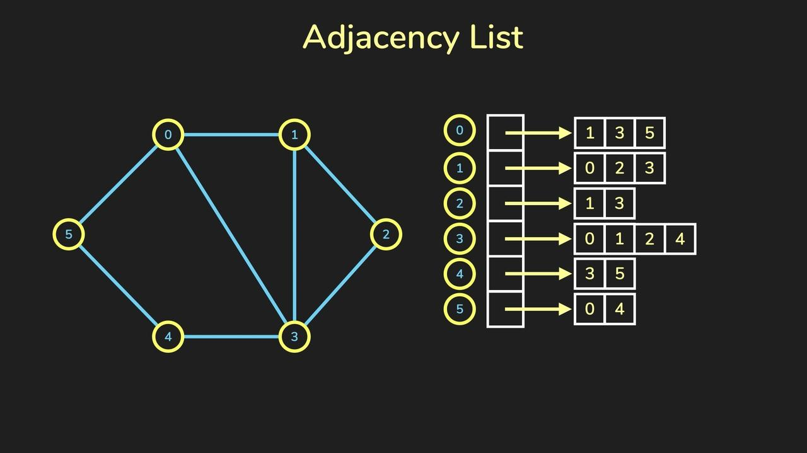

Introduction
================

图（Graph）是一种常见的数据结构，用于表示节点之间的关系。
它由节点（Vertex或Node）和边（Edge）组成，其中节点表示图中的实体，而边表示这些实体之间的关系。
图可以用于表示许多实际应用场景，例如社交网络、道路网络、电路网络等等。

图可以分为有向图和无向图。在有向图中，边是有向的，表示从一个节点指向另一个节点的方向。
在无向图中，边是无向的，表示节点之间的关系是双向的。另外，图还可以带有权重，表示节点之间的关系有一个具体的数值。

Adjacency Matrix
-----------------------

邻接矩阵

.. image:: ../_static/7-graph/tree-matrix.PNG
   :width: 700px

Adjacency List
-----------------------

邻接列表

