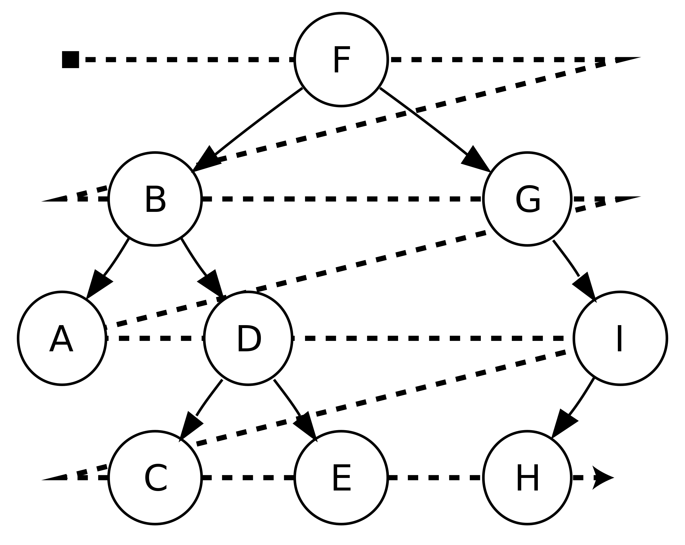

Tree Traversal 树的遍历
================================

https://en.wikipedia.org/wiki/Tree_traversal

深度优先搜索 Depth-first search
-------------------------------------

https://en.wikipedia.org/wiki/Depth-first_search

是一种用于遍历或搜索树或图的算法。这个算法会尽可能深地搜索树的分支。
当节点v的所在边都己被探寻过，搜索将回溯到发现节点v的那条边的起始节点。
这一过程一直进行到已发现从源节点可达的所有节点为止。
如果还存在未被发现的节点，则选择其中一个作为源节点并重复以上过程，整个进程反复进行直到所有节点都被访问为止.

分作前序遍历、中序遍历、后序遍历，前、中、后代表根节点在遍历时的位置。

.. image:: ../_static/6-tree/Sorted_binary_tree_ALL_RGB.svg.png
   :width: 700px

Depth-first traversal (dotted path) of a binary tree:

  Pre-order (node visited at position red ●):
      F, B, A, D, C, E, G, I, H;
  In-order (node visited at position green ●):
      A, B, C, D, E, F, G, H, I;
  Post-order (node visited at position blue ●):
      A, C, E, D, B, H, I, G, F.

Pre-order的动画演示：

.. image:: ../_static/6-tree/dfs-animation.gif
   :width: 700px

广度优先搜索 Breadth-first search
------------------------------------

https://en.wikipedia.org/wiki/Breadth-first_search

又译作宽度优先搜索，或横向优先搜索，是一种图形搜索算法。简单的说，BFS是从根节点开始，沿着树的宽度遍历树的节点。如果所有节点均被访问，则算法中止。

动画演示

.. image:: ../_static/6-tree/Breadth-First-Search-Algorithm.gif
   :width: 700px
