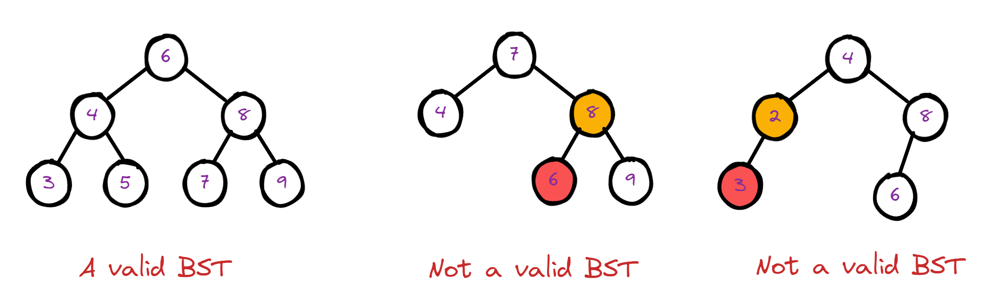

LeetCode 练习
================

Validate Binary Search Tree
---------------------------------

各大公司热门面试题

https://leetcode.com/problems/validate-binary-search-tree/

如何才算一个二叉搜索树？

- 当前节点的值大于其所有的左子树节点的值
- 当前节点的值小于其所有的右子树节点的值
- 当前节点的左子树和右子树也是二叉搜索树

常用的解题方法

- 按二叉搜索树的定义，暴力比较
- 按In order遍历这个树，然后对遍历结果进行检查，看是否是顺序排列

暴力解法
~~~~~~~~~~~~

基本的逻辑：

- 如果root是None，则返回True
- 否则就已当前节点为root根节点，找到左子树的最大值，右子树的最小值
- 如果左子树的最大值比当前节点的值大，或者右子树的最小值比当前节点值小，返回False
- 否则就继续查找，以当前节点的左右节点分别为根节点，进行递归检查

参考代码

.. literalinclude:: ../_code/8-tree-traversal/valid-bst-solution1.py
   :language: python
   :linenos:

暴力解法的优化

.. literalinclude:: ../_code/8-tree-traversal/valid-bst-solution2.py
   :language: python
   :linenos:

DFS In Order遍历
~~~~~~~~~~~~~~~~~~~~~~

参考代码

.. literalinclude:: ../_code/8-tree-traversal/valid-bst-solution3.py
   :language: python
   :linenos:

代码优化

.. literalinclude:: ../_code/8-tree-traversal/valid-bst-solution4.py
   :language: python
   :linenos:
