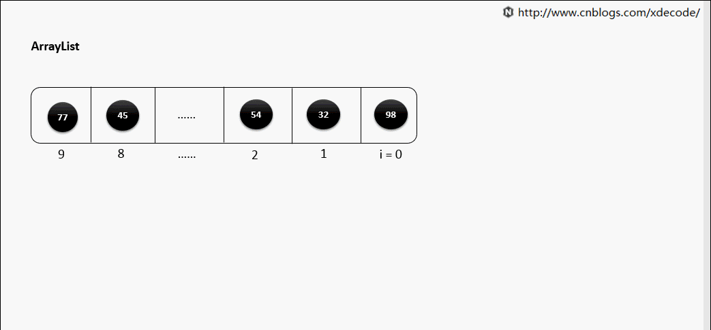
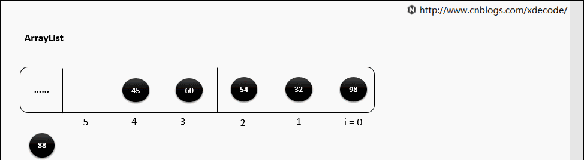
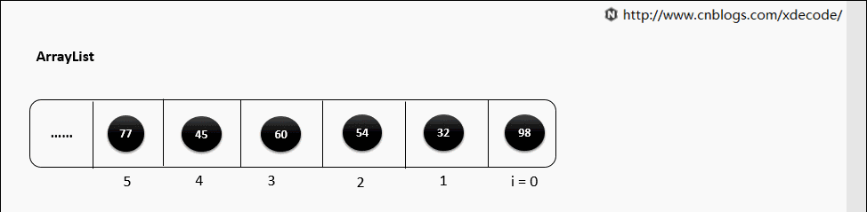

Operations
==============

adding item (添加元素)
---------------------------

末尾添加
~~~~~~~~~

往Array的末尾添加元素的时间复杂度是 ``O(1)``

Array预先分配的内存空间满了怎么办？

如果预先分配的内存空间满了，那么Array会自动扩容，扩容的时间复杂度是 ``O(n)`` 具体操作是：

- 申请一个新的内存空间，大小是原来的2倍(这个倍数可以自己设置)
- 把原来Array中的所有元素依次复制到新的内存空间
- 释放原来Array占用的内存空间

所以，如果你事先知道Array中元素的个数，那么最好在初始化的时候就指定Array的容量，避免不必要的扩容操作。
但如果你不知道Array中元素的个数，初始化size的大小是一个 ``trade-off`` ：

- 如果初始size太小，那么扩容操作会频繁发生，
- 如果size太大，那么会浪费很多内存空间。

随机位置添加
~~~~~~~~~~~~~~

如果要在Array中间添加元素，那么需要把index后面的所有元素依次向后移动一位，时间复杂度是 ``O(n)``

Deleting Item（删除元素）
---------------------------

末尾删除
~~~~~~~~~

删除Array末尾的元素，时间复杂度是 ``O(1)``

随机位置删除
~~~~~~~~~~~~~~

如果要删除Array中间的元素，那么需要把index后面的所有元素依次向前移动一位，时间复杂度是 ``O(n)``

